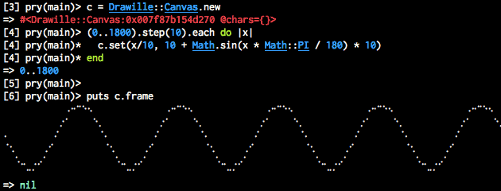
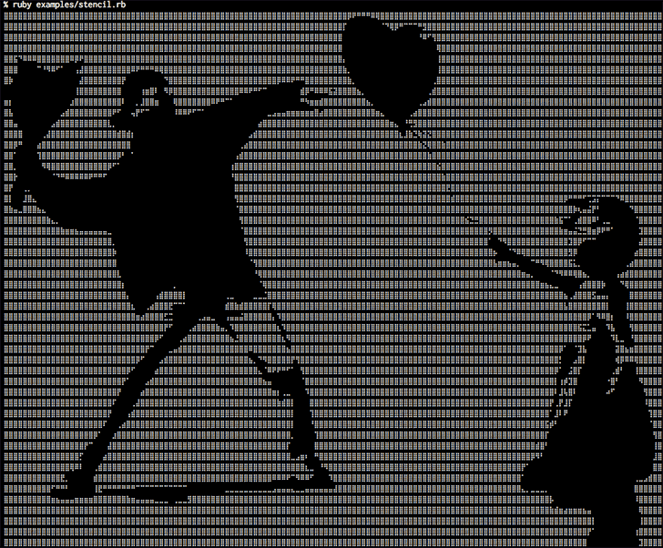
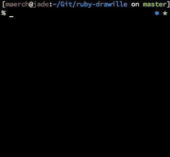
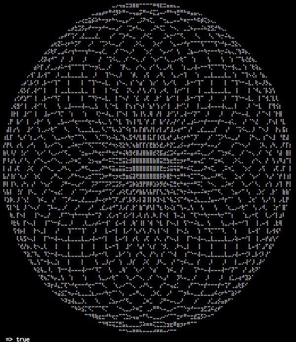

Drawille for Ruby
========
[](http://badge.fury.io/rb/drawille)
[](https://codeship.com/projects/101918)

Draw in your terminal with Unicode [Braille][] characters. Implementation based on [drawille][] by @asciimoo.

[Braille]: http://en.wikipedia.org/wiki/Braille
[Drawille]: https://github.com/asciimoo/drawille


## Installation

Add this line to your application's Gemfile:

    gem 'drawille'

And then execute:

    $ bundle

Or install it yourself as:

    $ gem install drawille

## Usage

Drawille can be used like the Python implementation due to the similar API. Here is one of its examples:

```ruby
require 'drawille'

canvas = Drawille::Canvas.new

(0..1800).step(10).each do |x| 
  canvas.set(x/10, 10 + Math.sin(x * Math::PI / 180) * 10) 
end

puts canvas.frame
```



But in the end you can use it in every possible situation where you have only two colors. This means it is perfect for some stencil graffitis.

```ruby
require 'drawille'
require 'chunky_png'

include ChunkyPNG

canvas = Drawille::Canvas.new

def draw canvas, img, xoffset=0
  (0..img.dimension.width-1).each do |x|
    (0..img.dimension.height-1).each do |y|
      r = Color.r(img[x,y])
      g = Color.g(img[x,y])
      b = Color.b(img[x,y])
      canvas.set(x+xoffset, y) if (r + b + g) > 100
    end
  end
end

draw canvas, Image.from_file('examples/stencil-1.png')
draw canvas, Image.from_file('examples/stencil-2.jpg'), 141

puts canvas.frame
```



With a "flipbook" you can also create animations on your terminal.



This implementation also includes a [Turtle graphics](http://en.wikipedia.org/wiki/Turtle_graphics) API for all your beloved fractals:

```ruby
require 'drawille'

canvas = Drawille::Canvas.new

frame = canvas.paint do
  move 300, 300
  down

  36.times do
    right 10
    36.times do
      right 10
      forward 8
    end
  end

end.frame

puts frame
```



### Turtle-API

```ruby
  canvas = Drawille::Canvas.new
  canvas.paint do
    # Move your brush with the following commands
  end
``` 

``forward 10`` or ``fw 10``

Moves your brush in the current direction (default is 0 which points to the right). Please note that your brush has to be set down to actually draw. 

``back 10`` or ``bk 10``

Moves your brush in the opposite direction. Please note that your brush has to be set down to actually draw. 

``right 90`` or ``rt 90``

Turn the direction of the brush by 90 degrees to the right.

``left 90`` or ``lt 90``

Turn the direction of the brush by 90 degrees to the left.

``up`` or ``pu``

Sets the brush up which means all following operations will have no effect on the canvas itself.

``down`` or ``pd``

Sets the drush down which means that moving the brush will draw a stroke.

``move 100, 100`` or ``mv 100, 100``

Moves the brush to the position ``x=100`` and ``y=100``.

``line from: [30, 20], to: [100, 100]``

A line between the two given points will be drawn. The movement to the starting point will be with an ``up`` brush, but the former state of the brush will be restored after this line.

### ``Drawille::Canvas`` API

``#set(x, y)`` / ``#[x, y] = true``

Sets the state of the given position to ``true``, i.e. the ``#frame`` method will render a point at ``[x,y]``.

``#unset(x, y)`` / ``#[x, y] = false``

Sets the state of the given position to ``false``, i.e. the ``#frame`` method will _not_ render a point at ``[x,y]``.

``#toggle(x, y)``

Toggles the state of the given position.

``#clear``

No point will be rendered by the ``#frame`` method.

``#frame``

Returns newline-delimited string of the given canvas state. Braille characters are used to represent points. Please note that a single character contains 2 x 4 pixels.

### Flip-book

```ruby
c = Drawille::Canvas.new
f = Drawille::FlipBook.new

c.paint do
  move 200, 100
  down

  36.times do
    right 10
    36.times do
      right 10
      forward 8
    end
    f.snapshot canvas
  end

end

f.play repeat: true, fps: 6
``` 

With the flip-book it is possible to create and play animations. Just draw on the canvas as usual and create a snapshot for every frame you want to be included in the animation.

``FlipBook#snapshot canvas``

Saves a snapshot of the current state of the canvas.

``FlipBook#snapshot#play``

Will render the animation on the terminal. The method also takes an option hash with the options ``:repeat`` ``:fps``. 

As an alternative to snapshots it is possible to pass a block which will be called consecutively and should return a canvas which will be rendered as a frame in the animation or ``nil`` to stop the animation. 

## License

MIT License

Permission is hereby granted, free of charge, to any person obtaining
a copy of this software and associated documentation files (the
"Software"), to deal in the Software without restriction, including
without limitation the rights to use, copy, modify, merge, publish,
distribute, sublicense, and/or sell copies of the Software, and to
permit persons to whom the Software is furnished to do so, subject to
the following conditions:

The above copyright notice and this permission notice shall be
included in all copies or substantial portions of the Software.

THE SOFTWARE IS PROVIDED "AS IS", WITHOUT WARRANTY OF ANY KIND,
EXPRESS OR IMPLIED, INCLUDING BUT NOT LIMITED TO THE WARRANTIES OF
MERCHANTABILITY, FITNESS FOR A PARTICULAR PURPOSE AND
NONINFRINGEMENT. IN NO EVENT SHALL THE AUTHORS OR COPYRIGHT HOLDERS BE
LIABLE FOR ANY CLAIM, DAMAGES OR OTHER LIABILITY, WHETHER IN AN ACTION
OF CONTRACT, TORT OR OTHERWISE, ARISING FROM, OUT OF OR IN CONNECTION
WITH THE SOFTWARE OR THE USE OR OTHER DEALINGS IN THE SOFTWARE.
